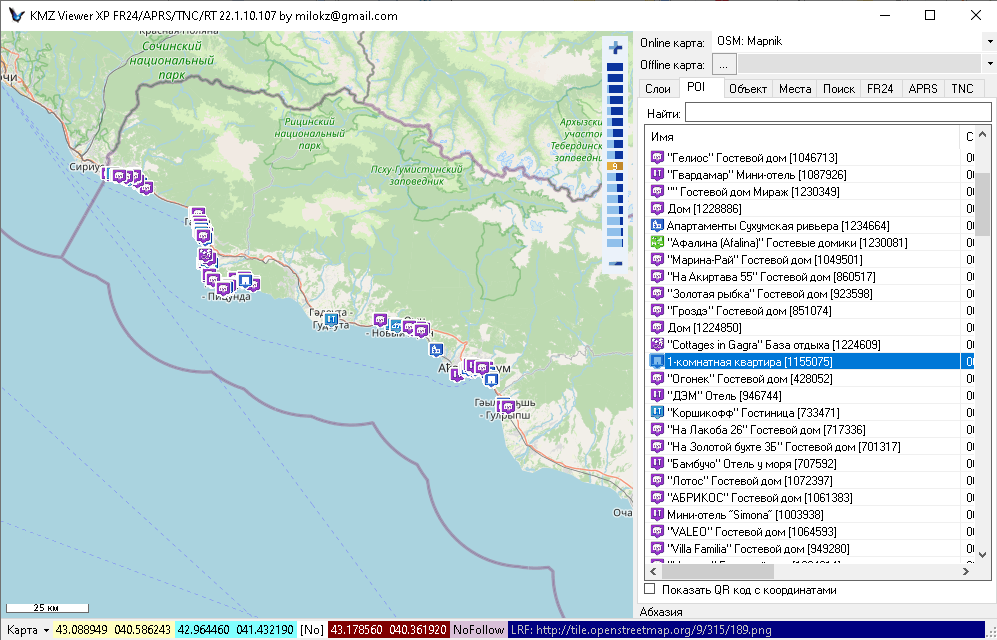

# TvilGrabber

Получения карты объектов с Tvil.ru по регионам (KMZRebuilder plugin).     
Приложение может быть использовано как автономно, так и вместе с [KMZRebuilder](https://github.com/dkxce/KMZRebuilder).    
Результат представлен в виде kmz файла, который может быть открыт в [KMZRebuilder](https://github.com/dkxce/KMZRebuilder) и [KMZViewer](https://github.com/dkxce/KMZViewer).     

